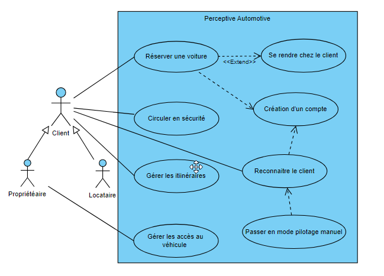
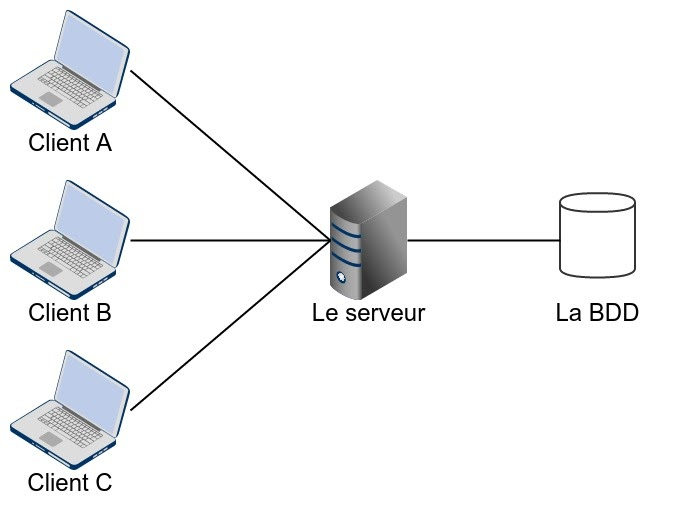

# Perceptive Automotive

## Modélisation

### Use case

## Architecture de l'infrastructure

## Architecture logicelle

### Architecture en couches 3-tiers

## Installation du simulateur Carla

* Installer miniconda: https://docs.conda.io/projects/miniconda/en/latest/
* Créer un environnement virtuel: **conda create --name carla python=3.8**
* Activer cet environnement: **conda activate carla**
* Installer les packages: **pip install -r Embarqué\ -\ Automotive/requirements.txt**
* Installer le serveur Carla: https://github.com/carla-simulator/carla/releases (dézipper puis lancer l'executable). Les clients pourront y accéder via localhost:2000.