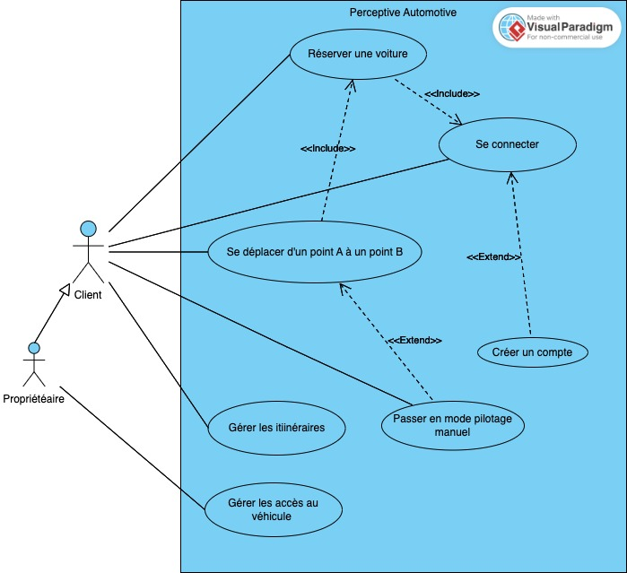

# Perceptive Automotive

### Cas d'utilisation


## Architecture de l'infrastructure embarquée


## Architecture de l'infrastructure SaaS


### Diagramme de séquence


## Architecture logicelle

### Architecture en couches 3-tiers


## Installation du simulateur Carla

* Installer miniconda: https://docs.conda.io/projects/miniconda/en/latest/
* Créer un environnement virtuel: `conda create --name carla python=3.8`
* Activer cet environnement: `conda activate carla`
* Installer les packages: `pip install -r Embarqué\ -\ Automotive/requirements.txt`
* Installer le serveur Carla: https://github.com/carla-simulator/carla/releases (dézipper puis lancer l'executable). Les clients pourront y accéder via localhost:2000.

### Generate dataset
```bash
python generate_traffic.py -n 100 -w 50
python manual_control.py
```
* Appuyer sur la touche 'R' pour enregistrer le comportoment de l'expert
