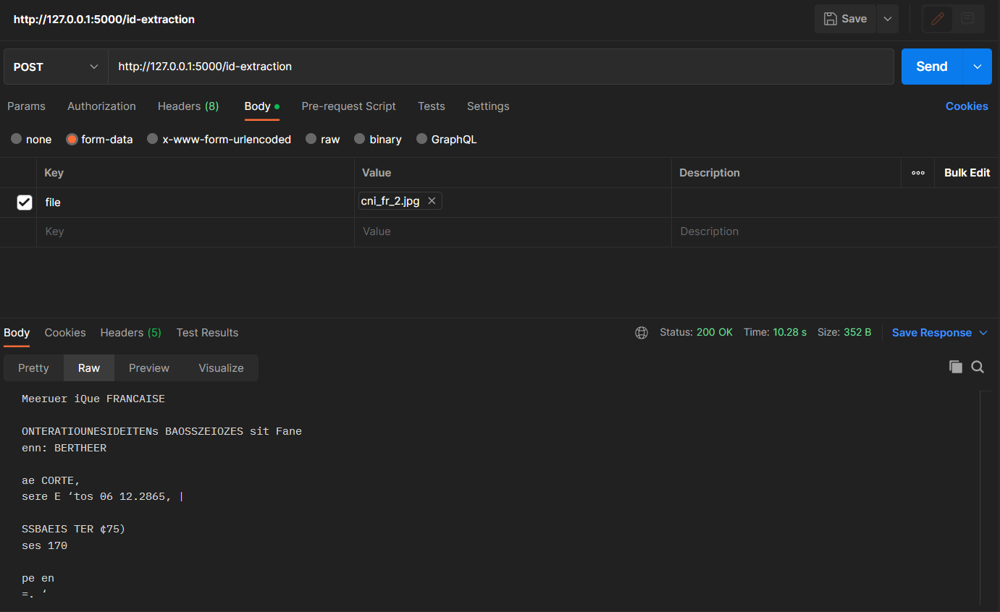

# Reconnaissance de texte et d'image de documents d'identité

## Installation
1. Installer Python version supérieure à 3.9.
2. Télécharger Tesseract à partir du lien suivant : [Tesseract GitHub](https://github.com/UB-Mannheim/tesseract/wiki).
3. Ajouter Tesseract au chemin d'accès de la variable d'environnement PATH.
4. Exécuter la commande suivante pour installer les dépendances Python nécessaires :

```shell
pip install -r requirements.txt
```

## Lancement du serveur Flask
Une fois que Tesseract est installé et les dépendances Python sont installées :

```shell
python reconnaissance.py
```

- Une fois le serveur Flask lancé, vous pouvez effectuer une requête POST de type multipart/form-data (avec Postman par exemple)

